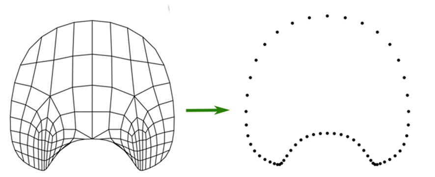
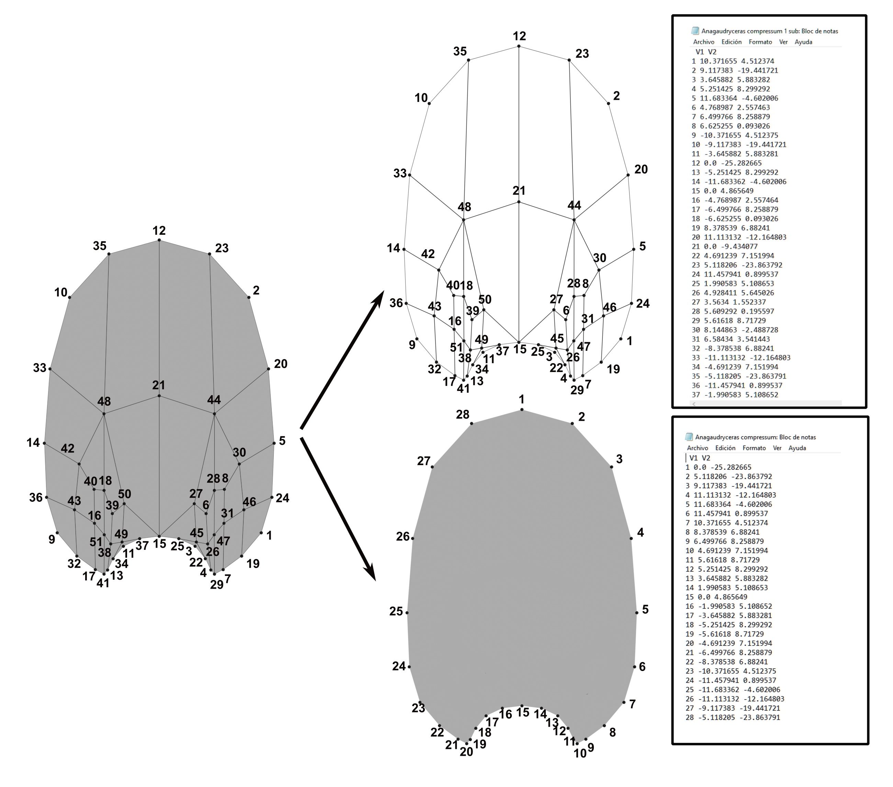

---
output:
  html_document: default
  pdf_document: default
---

{style="display: block; margin: 1em auto" width="130"}

# Vertex Extractor V.0.0.1

Daniel Andrés Morón-Alfonso

Vertex Extractor is an intuitive, simple, and efficient tool designed to extract point coordinates from legacy .obj files, whether in 2D or 3D. This tool offers two main functions: extracting all the vertices from .obj files and specifically extracting the margin vertices of 2D figures, which are ordered in a counterclockwise direction. This functionality is particularly useful for Geometric Morphometrics and other fields that require obtaining points in a precise order. The extracted data is saved in .txt files, with a format that varies depending on the dimensions of the original .obj file. The generated files may contain three to four columns, depending on the type of file. The first column indicates the number of the extracted point, while the remaining columns provide the coordinates in x, y, or z. Vertex Extractor was developed to work with the semi-landmark definition methodology proposed in Morón-Alfonso et al. (2021), also employed in Morón-Alfonso et al. (2023) and Morón-Alfonso et al. (2024).

{style="display: block; margin: 1em auto" width="386"}

**Figure 1**. Translation of a 2D model of an ammonite whorl profile outline into an ordered set of points.

{style="display: block; margin: 1em auto" width="448"}

**Figure 2**. Translation of a 2D model of an ammonite whorl profile outline into a set of points, showing two possible results: above, all the coordinates of the original .obj file; below, only the margin points of the original model.

**References:**

Morón-Alfonso, D., Allaire, N., and Ginot, S. 2024. Comparative assessment of outline-based vs. virtual modeling-based methods to analyze the ammonoid whorl profile. Palaeontologia Electronica*,* *in press*.

Morón-Alfonso, D.A., Cichowolski, M., Hoffmann, R., Korn, D., Vennari, V., and Allaire, N. 2023. The intriguing shapes of the ammonoid whorl. Palaeontologia Electronica*,* 26:1-23. <https://doi.org/10.26879/1263>.

Morón-Alfonso, D.A., Hoffmann, R., and Cichowolski, M. 2021. Geometric morphometrics in ammonoids based on virtual modelling. Palaeontologia Electronica*,* 24.3.a29. <https://doi.org/10.26879/1157>.
